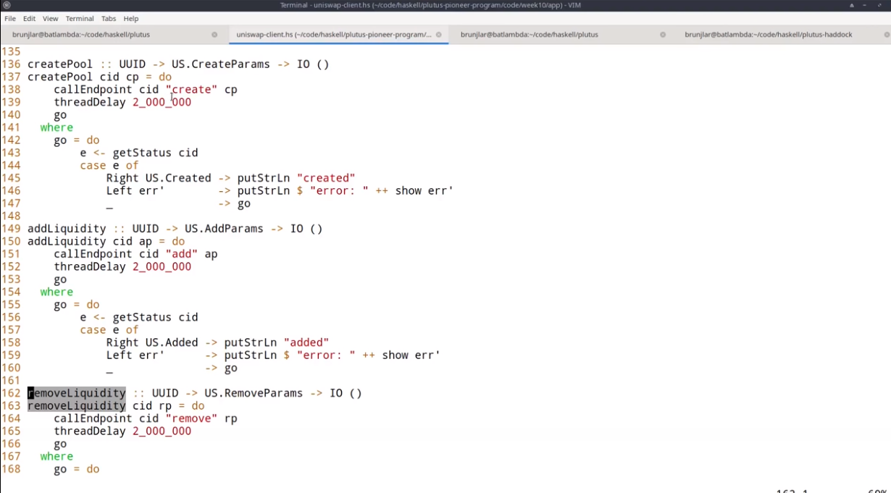
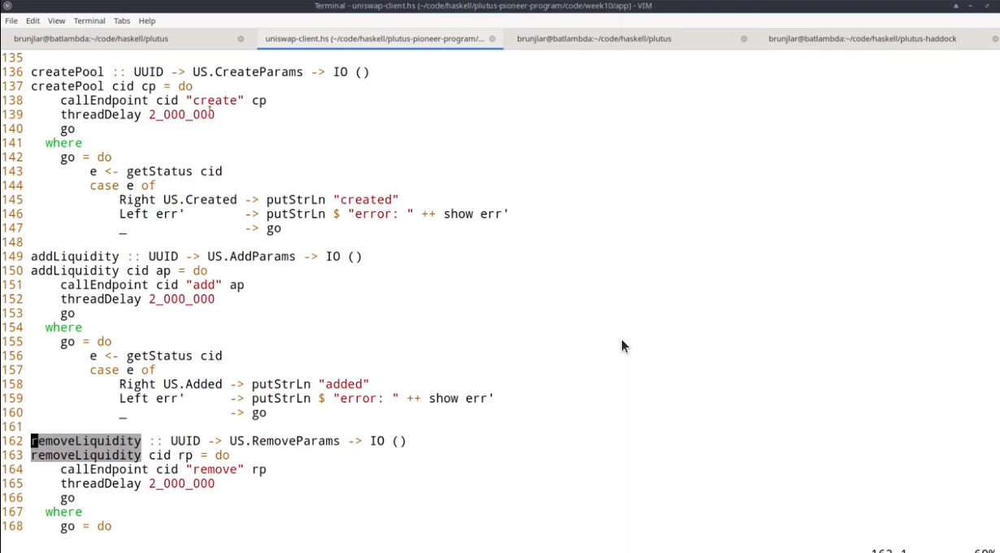

Week 10 - Uniswap
=================

.. note::
      These is a written version of `Lecture
      #10 <https://youtu.be/Dg36h9YPMz4>`__.

      In this lecture we look at an implementation of Uniswap in Plutus.

      This is the last lecture in the Plutus Pioneer Program. However, there will be a special lecture once it is possible to deploy contracts to the testnet.

In this lecture we won't be introducing any new topics or concepts. Instead we will do an end-to-end walk through of a demo that Lars wrote some months ago that 
clones the very popular Uniswap contract from Ethereum.

The one new thing we will look at following several requests is how you can query the endpoints created by the PAB with Curl commands just from the console.

What is Uniswap
---------------

So for those of you who haven't heard of Uniswap, what is Uniswap?

Uniswap is a so-called DeFi, or decentralized finance application, that allows swapping of tokens without any central authority. In 
the case of Ethereum it's ERC20 tokens.

So you don't need a centralized exchange, the traditional way to exchange tokens or other crypto assets. Instead everything is governed by 
smart contracts and works fully automatically on the blockchain.

Another interesting feature of Uniswap is that it doesn't discover prices the usual way with the so-called order book, but uses a different
automatic price discovery system. The idea is that people can create so-called liquidity pools. 

If they want other users to be able to swap two different tokens, then somebody can create a liquidity pool and put a certain amount of those two tokens 
in this liquidity pool, and in return the creator of the pool will receive so-called liquidity tokens that are specific to this one pool. 

Other users can use that pool to swap. They take some amount of one of the tokens out in exchange for putting an amount of the other token back in.

Additionally, people can also add liquidity to the pool and receive liquidity tokens, or they can also burn liquidity tokens in exchange for tokens from the pool.

And all these features are also implemented in the version of Uniswap that works on Cardano that we're going to look at now.

.. figure:: img/pic__00149.png

So let's look at the various operations that are available in turn.

It all starts by somebody setting up the whole system. So some organization or entity that wants to offer this Uniswap service. 

It starts with a transaction that creates a UTxO at this script address, here we call that *factory* for Uniswap factory. It contains an NFT that identifies the factory, 
the same trick that we have used a couple of times before, and as datum, it will contain the list of all liquidity pools.

So in the beginning, when the factory is just being created, that list will be empty.

Now let's assume that one user, Alice wants to create a liquidity pool for tokens A and B. A pool that allows others to swap A against B or B against A.

.. figure:: img/pic__00150.png

She has to provide some initial liquidity for the pool. So she needs some amount of token A and some amount of token B, let's say she has 1,000A and 2000B.

It's important to note here that the ratio between A and B reflects Alice's belief in the relative value of the tokens. So if she wants to set up a pool with 
1000A and 2000B, then she believes that one A has the same value as two Bs.

In order to create the liquidity pool, she will create a transaction with two inputs and three outputs.

.. figure:: img/pic__00151.png

The two inputs will be the liquidity she wants to provide; the 1000A and 2000B and the Uniswap factory invoked with the create redeemer. The three outputs 
will be the newly-created pool.

We call it *Pool AB* here to indicate that it contains tokens AB, which will contain the liquidity that Alice provided; the 1000A and the 2000B and a freshly-minted 
token that identifies this pool, an NFT, called *AB NFT* here.

The datum of the pool, the 1415, will be the amount of liquidity tokens that Alice receives in return for setting up this pool and providing the liquidity. #

If you wonder about the number, that is the square root of the product of 1000 and 2000, so that's how the initial amount of liquidity tokens is calculated. It 
doesn't really matter, you could scale it arbitrarily, but that's the way Uniswap does it.

The second output is the Uniswap factory again, with the same NFT as before that identifies it. And now the datum has been updated. So in this list that was 
empty before, the list of all liquidity pools, there is now an entry for the newly-created AB pool.

Finally, there's a third output for Alice, where she receives the freshly-minted liquidity tokens, called *AB* here to indicate that they belong to the pool AB.

Now that the liquidity pool has been set up, other users can use it to swap.

.. figure:: img/pic__00152.png

So let's assume that Bob wants to swap 100A against B. What will Bob do?

He will create a transaction that has two inputs and two outputs. The two inputs are the 100A he wants to swap, and the pool with the swap redeemer. The outputs 
are the Bs he gets in return.

In this example, that would be 181B and the updated pool. So the pool now has the additional 100A that Bob provided. So now it's 1,100A, and it has 181B fewer than before.

It still, of course, has the NFT that identifies the pool and the datum hasn't changed because the amount of liquidity tokens that have been minted hasn't changed.

Now, of course, the question is, where does this 181 come from? This is this ingenious idea, how price discovery works in Uniswap.

So the rule is roughly that the product of the amounts of the two tokens must never decrease. Initially we have 1000 As and 2000 Bs and the product is 2 million.

If you do the calculation, then you will see that after the swap 1100*1819 will be slightly larger than 2 million.

If you think about it or try a couple of examples by yourself, then you will see that in principle, you will always pay this ratio of the As and Bs in the pool, at least if you swap small amounts.

So originally the ratio from A to B was 1:2, 1000:2000. 100 is relatively small in comparison to the 1000 liquidity, so Bob should roughly get 200B, but he does get less
and there are two reasons for that.

One is that the amount of tokens in the liquidity pool is never allowed to go to zero. And the more of one sort you take out, the more expensive it gets - 
the less you get in return. So 100 depletes the pool a bit of As, so Bob doesn't get the full factor 2 out, he gets a little bit less out. That's exactly how this product formula works.

This also makes it ingenious, because it automatically accounts for supply and demand. If the next person also wants to swap 100A, they would get even less out.

The idea is if a lot of people want to put A in and want to get B in return, that means the demand for B is high. And that means the price of B in relation to A 
should rise. And that is exactly what's happening.

So the more people do a swap in this direction, put A in and get B out, the less of the gap because the price of B rises. If there were swaps in the other direction, 
you would have the opposite effect.

If there's an equal amount of swaps from A to B and B to A, then this ratio between the two amounts would stay roughly the same.

There's an additional reason why Bob doesn't get the full 200 that he might expect, and that is fees.

We want to incentivize Alice to set up the pool in the first place. She won't just do that for fun, she wants to profit from it, so she wants to earn on swaps that people make.

The original product formula is modified a bit to insist that the product doesn't only not decrease, but that it increases by a certain amount, a certain percentage, 
depending on how much people swap. That's 3% in this example of the 100A that Bob swaps, and it would be the same if you swap B instead.

This is basically added on top of this product, so anytime somebody swaps, not only does the product not decrease, it actually increases. And the more people swap, the more it increases.

The idea is that if Alice now would close the pool by burning her liquidity tokens, she gets all the remaining tokens in the pool and the product 
would be higher than what she originally put in.

So that's her incentive to set up the pool in the first place. 

The next operation we look at is the add operation where somebody supplies the pool with additional liquidity.

.. figure:: img/pic__00153.png

So let's say that Charlie also believes that the ratio from A to B should be 1:2 and he wants to contribute 400A and 800B. 

He could also have tokens in a different ratio; the ratio reflects his belief in the true relative value of the tokens.

So Charlie wants to add 400 As and 800 Bs, and he creates a transaction with two inputs and two outputs. The inputs are the pool and his contribution, 
his additional liquidity, and the outputs are the updated pool where now his As and Bs have been added to the pool tokens. Note that now the datum has changed.

So we had 1415 liquidity tokens before, and now we have 1982, and the difference, the 567, go to Charlie. So that's the second output of this transaction, and that's the reward to Charlie for providing this liquidity.

And there the formula is a bit complicated, but in principle, it also works with the product. So you check how much the product was before and after the tokens 
have been added and you take into account the number that have already been minted. That also ensures that now basically Alice profits from the fees that Bob
paid with the swap and Charlie doesn't.

The specific formula doesn't matter. The idea is just that it's fair.

So people should receive liquidity tokens proportional to their contribution, but, if they only add liquidity after a couple of swaps have already happened,
then they shouldn't profit from the fees that have accumulated in the meantime.

The next operation we look at is called *remove* and it allows owners of liquidity tokens for a pool to burn some of them.

.. figure:: img/pic__00154.png

So in this example, let's assume that Alice wants to burn all her liquidity tokens. She could also keep some, she doesn't have to burn all, but in this example, she wants
to burn all her 1415 liquidity tokens.

So for that, she creates another transaction with two inputs and two outputs, the inputs are the liquidity token she wants to burn and, of course, 
the pool again with the *remove* redeemer.

The outputs are the tokens from the pool that she receives in return, so in this case, she would get 1078A and 1869B. The second output is the updated pool.

So the 1078A and 1869B have been removed from the pool and the datum has been updated, so the 1415 liquidity tokens that Alice burnt are now subtracted 
from the 1982 we had before. We see that 567 are remaining which are exactly those that Charlie owns.

The formula for how many tokens Alice gets for burning liquidity tokens is again somewhat complicated, but it's basically just proportional.

So we know how many liquidity tokens there are in total, 1982, from the datum. And she basically just gets 1415:1982 of the pool. And she gets the tokens in the ratio that they are in now.

So the 1072:1869 should be the same ratio as the 1500:2619 which means that by burning, you don't change the ratio of the pool.

The last operation is *close* and it is for completely closing a pool and removing it.

.. figure:: img/pic__00155.png

This can only happen when the last remaining liquidity tokens are burnt.

So in our example, Charlie holds all the remaining 567 liquidity tokens and therefore he can close down the pool.

In order to do that, he creates a transaction with three inputs. One is the factory. Note that we only involve the factory when we create the
pool and now when we close it again, which also means that the contention on the factory is not very high.

So the factory only gets involved when new pools are created and when pools are closed down, but once they exist and as long as they are not closed, the
operations are independent of the factory.

We just need the factory when we want to update the list of existing pools, and by the way, this list is used to ensure that there won't be duplicate pools. So 
the create operation that we looked at in the beginning will fail if somebody tries to create a pool that already exists for a pair of tokens that already exist.

Okay, so let's go back to the *close* operation.

So the first input is the factory with the *close* redeemer, second the input is the pool that we want to close. And third input is 
all the remaining liquidity tokens. 

We get two outputs, one is the updated factory. In this case we only had one pool, so the list only contains this one pool, and this is now removed from the
list. The second output contains of all the remaining tokens, all the tokens that are still in the pool when it gets closed down.

So the remaining liquidity tokens are burnt and Charlie gets all the remaining tokens from the pool.

.. figure:: img/pic__00156.png

Code for Uniswap is actually part of the Plutus repository and it is in the plutus-usecases library, split into four modules that are imported by the
Plutus.Contracts.Uniswap module - OnChain, OffChain, Types and Pool.

So as the names suggest, OnChain contains the on-chain validation, OffChain contains the off-chain contracts, Types contains common types, and 
Pool contains the business logic, the calculations, how many liquidity tokens the creator of a pool gets, how many tokens you get when you add liquidity
to a pool, how many tokens you get back when you burn liquidity tokens and under which conditions a swap is valid.

We won't go through all of that in too much detail. It contains nothing we haven't talked about before, but let's at least have a brief look.

So let's look at the Types module first.

.. figure:: img/pic__00157.png

*U* represents the Uniswap coin, the one that identifies the factory.

.. figure:: img/pic__00158.png

*A* and *B* are used for pool operations where we have these two sorts of tokens inside the pool.

.. figure:: img/pic__00160.png

*PoolState* is the token that identifies a pool, actually in the diagram earlier I said it's an NFT. By definition, an NFT is something that only 
exists once. Actually here in the implementation for each pool, an identical coin is created that identifies that pool. So it's not strictly speaking an NFT.

All the liquidity pools have one coin of that sort.

.. figure:: img/pic__00161.png

*Liquidity* is used for the liquidity tokens that the liquidity providers get.

.. figure:: img/pic__00162.png

And all these types are then used in the coin A type. So A is a type parameter, that's a so-called *phantom* type. So that means it has no 
representation at run time. It's just used to not mix up the various coins to make it easier to see what goes where, so in the datum, a coin 
is simply an asset class that we have seen before. Recall that *AssetClass* is a combination of currency symbol and token name.

.. figure:: img/pic__00163.png

Then amount is just a wrapper around integer that also contains such a phantom type parameter, so that we don't confuse amounts for token A and token B, for example.

.. figure:: img/pic__00164.png

Then we have some helper functions, for example *valueOf* for constructing a *Value* from *Coin* and *Amount*. Here, for example, we see the use of this phantom type.

That's actually a common trick in Haskell because now if you have, for example, pool operations that have two different coins and two different amounts for the different coins.
And if the one is tagged with this type capital A and the other with capital B, then normally one could easily confuse them and somehow do operations with the one 
coin, with the amount for the other, and then make a mistake.

And here the type system enforces that we don't do that. So we can only use this value of function, for example, if we a coin and an amount with the same tag type tag.

So as I said, that's a common trick in Haskell, some lightweight type level programming that doesn't need any fancy GHC extensions.

The *unitValue* function creates one amount of the given coin and *isUnity* checks whether this coin is contained in the value exactly once,

Then *amountOf* checks how often the coin is contained in the value, and finally *mkCoin* turns a currency symbol into a token name, into a coin.

.. figure:: img/pic__00165.png

Then we have the Uniswap type which identifies the instance of the Uniswap system we are running. So of course, nobody can stop anybody 
from setting up a competing Uniswap system with the competing factory, but the value of this type identifies a specific system.

And all the operations that are specific to pool will be parameterized by a value of this type, but it's just a wrapper around the coin U. And that is just the NFT that identifies the factory.

.. figure:: img/pic__00166.png

Then we have a type for liquidity pools, and that is basically just two coins, the two coins in there.

However, there is one slight complication, only the two types of tokens inside the pool matter, not the order, there is no first or second token.

.. figure:: img/pic__00167.png

And in order to achieve that, the *Eq* instance has a special implementation. If we want to compare two liquidity pools, we don't just 
compare the first field with the first field of the other, and the second with the second, but we also try the other way round.

So liquidity pool tokens AB would be the same as liquidity pool with tokens BA. So that's the only slight complication here.

.. figure:: img/pic__00168.png

Then we define the actions, that's basically the redeemers. So *Create* with argument *LiquidityPool* is for creating a new liquidity
pool, *Close* is  for closing one, *Swap* is for swapping, *Remove* is for removing liquidity and *Add* is for adding liquidity.

Note that in the diagrams we saw earlier for simplicity, the redeemer was called simply *Create*.
So I didn't mention this argument of type liquidity pool.

.. figure:: img/pic__00170.png

The datum is a bit more complex than we have seen before. It's not just a simple integer or similarly simple type, it's the type *UniswapDatum*.

There are two constructors, one for the factory and one for each pool. The factory will use the *Factory* constructor and the pool will use the *Pool* constructor.

And we saw before, the datum contains a list of all liquidity pools that currently exist. And the datum for *Pool* contains the *LiquidityPool* that we didn't
see in the diagram. It also contains something we did see in the diagram, the amount of liquidity that has been minted for this pool. Remember that gets updated when somebody adds liquidity or removes liquidity.

.. figure:: img/pic__00172.png

Next let's look at the *Pool* module, which as I explained before, contains the business logic, the calculations.

So we have *calculateInitialLiquidity*. It gets the initial amount of token A and B that are put into the pool and returns the liquidity tokens that are 
returned in exchange for those.

Then *calculateAdditionalLiquidity* for the case that the pool already exists and somebody provides additional liquidity. So the first two 
arguments are the amount of token already in there. Then the third one is the liquidity tokens that have already been minted for the pool. And 
the next two arguments are how many As and Bs are added to the pool. The result is how many liquidity tokens will be minted in exchange
for this additional amount.

.. figure:: img/pic__00173.png

The *calculateRemoval* function is for the opposite case. So given how many tokens are in the pool, how many liquidity tokens have been minted, how many 
liquidity tokens should be removed? It gives how many of tokens A and B remain in the pool.

Now *checkSwap* is arguably the central function of the whole Uniswap system. It calculates a swap.

This is how many As and Bs are originally in the pool and this says how many As and Bs there are after the swap in the pool. And it just returns whether that's okay or not.

So in principle, it just checks that the product of the last two arguments is larger than the product of the first two.

And we noted before, it's a bit more complicated because the fee is taken into account. So in this case, it's 0.3% and you can see this is taking into account here.

.. figure:: img/pic__00175.png

It also makes sure that none of the amounts ever drops to zero. So it's not allowed to remove all coins of one sort or of both from a pool.
That also makes sense because of this product, if one of the factors was zero, then of course it couldn't be larger than it was before.

Finally, there's this *lpTicker* function. It's just a helper function that given a liquidity pool, computes a token name for the liquidity token. The idea 
here is that this token name should only depend on the liquidity pool and should be unique. So each pair of tokens should result in a unique token name. In 
principle it just takes the currency symbols and the token names of the two tokens or coins, concatenates all of them and hashes that, and then uses
the hash of the concatenation to get something unique.

A slight complication here is that again we must make sure that the order of coins in the pool doesn't matter.

.. figure:: img/pic__00176.png

Now let's look at the on-chain part. Only two functions are exported.

First *mkUniswapValidator*, to make the validator for the Uniswap, both factory and pools, because they share the same script address. They are just distinguished by the datum and by the coins that identify them.

Then *validateLiquidityForging* which is the monetary policy script for the liquidity tokens, but there is a lot of code in this module and we 
don't want to go through it in detail, let's rather look at the structure.

.. figure:: img/pic__00178.png

So this is the *mkUniswapValidator* function. This function contains all the cases for factories and pools and the various redeemers.

And we have the function *validateLiquidityForging*, which is the monetary policy for liquidity tokens. The idea here is that it doesn't contain 
any logic and simply delegates the logic to the Uniswap validator. The way it does that is it checks the inputs of the forging transaction
and checks that it either contains a factory or contains a pool, because if it does, then we know that this validator will 
run and then the validator can check that the forging is okay.

The way it checks whether either the factory or pool is an input is via the coins that identify a factory or pool. So it checks whether this 
Uniswap factory coin is in the input or whether one of the pool coins is in the input.

And then we just have helper functions for all the various cases and they look quite long but it's all straightforward. It's basically what we saw 
in the diagram, just spelled out in detail so that all these conditions are satisfied for all the different cases.

.. figure:: img/pic__00179.png

Finally, let's look at the off-chain code. 

.. figure:: img/pic__00181.png

No surprises here, it's the usual boiler plate.

.. figure:: img/pic__00182.png

We define two different schemas. The idea is that one is for the entity that creates the Uniswap factory, and that only has one endpoint *start* and no parameters.

Then once that is created a second schema for people that make use of this Uniswap system, and all the contracts in here will be parameterized by the uniswap
instance that the first action creates.

.. figure:: img/pic__00183.png

We make use of the state mechanism this monad writer mechanism that is accessible via *tell*, and basically for all the user operations, 
we have our own state, we call it *UserContractState*.

So there will be a helper contract that queries for all existing pools. So then the state would be using the *Pools* constructor and will return a
list of pools in a simplified form - it's just a nested pair of pairs of coin and amount in each pool.

Now the helper function to query the existing funds of a wallet that will just return a value. 

Then constructors for all the other operations. So  if they have happened, then one of those will be the state. For example, if we did a swap, then afterwards the status will be updated to swapped. If we removed liquidity, it will be updated to removed and so on.

.. figure:: img/pic__00184.png

Then some names for the various tokens, so "Uniswap" will be the token name of the NFT in the Uniswap factory, "Pool State" will be the token name for the
coins that identify the liquidity pools.

Then our usual boiler plate to actually get a script instance.

.. figure:: img/pic__00185.png

And the policy for the liquidity tokens.

Some various helper functions,

.. figure:: img/pic__00186.png

Then all the parameters for the endpoints. So, for example, if we want to create a pool we need to know the tokens and the amounts.

If you want to swap, it must know the tokens and how much to swap and the idea in the *SwapParams* datatype that one of the two last fields should be zero. So 
if you want to put in A and get out B, we've would specify the *spAmountA* for how many As we want to put in, but we would leave the *spAmountB* at zero, 
and the other way round if we want to swap Bs against As.

*CloseParams* for if you want to close a pool - we just have to specify which pool. So we give the two tokens that are in there.

*RemoveParams* - you have to specify the pool and how much liquidity we want to burn.

*AddParams* - again, identify the pool and how many As and how many Bs we want to add.

.. figure:: img/pic__00188.png

Now here we have the implementation.

So *start*, as we saw, sets up the whole system and it again makes use of this other use case we have used before, the *Currency.forgeContract* to mint
the factory NFT that's then used to identify the Uniswap factory.

.. figure:: img/pic__00189.png

The *create* contract is the contract that creates a liquidity pool. We see all of these will be, as we mentioned before, identified by the Uniswap value, 
which is the result of this *start* contract here. 

So we have *create*,

.. figure:: img/pic__00190.png

We have *close*, again parameterized by Uniswap,

.. figure:: img/pic__00191.png

*remove* ,

.. figure:: img/pic__00192.png

*add*,

.. figure:: img/pic__00193.png

and *swap*.

All these functions also make use of the functions from the *Pools* module, that contain the business logic. So that will be used both in the validator, 
on the on-chain side, as well as on the off chain side in these contracts here.

.. figure:: img/pic__00194.png

The *pools* contract just queries the existing pools. So it looks for the factory UTxO and checks the datum, and, as we know, 
the datum of the factory contains the list of all pools.

.. figure:: img/pic__00195.png

And finally *funds* just checks our own funds, the funds in the wallet, and returns them.

So these all return values but we want to write that in the state, and this is now done these endpoint definitions.

.. figure:: img/pic__00197.png

So first we have *ownerEndpoint* for setting up the whole system, which just uses the stop contract.

And then we have *userEndpoints*, which combine all these operations that a user can do.

Now there is no return value anymore, and instead we make use of the state. So we use the *Last* monoid again, so only the last *told* state will be kept.

And we also allow for error, so if there's an error in one of these contracts, then we will catch that error, but use a *Left* to write it in the state. If there was no error we write the appropriate user contract state value in the state with the *Right* constructor of *Either*.

.. figure:: img/pic__00198.png

Finally, we also have a *stop* endpoint that simply stops, it doesn't do anything. At any time you can invoke *stop* or one of the others, 
and if it was one of the others then recursively *userEndpoints* is called again, but in the case of *stop* not, so if the *stop* endpoint
is ever called then the contract stops.

There are also tests for Uniswap contained in this Plutus use-cases library, but we won't look at them now.

Let's rather look at the Plutus PAB part and how you can write a front-end for Uniswap.

There is actually one also contained in the Plutus repo. It's in the plutus-pab library and in the examples folder there's a Uniswap folder that 
contains an example on how to do that.

.. figure:: img/pic__00200.png

This has been copied it into our Plutus Pioneer Program repo and slightly modified it to make it more suitable for our purposes.

When we look at the Cabal file for this week's code, there are two executables.

One uniswap-pab, which will run the PAB server, and then uniswap-client, which is a simple console based front-end for the Uniswap application.

.. figure:: img/pic__00201.png

You see, in the *other-modules* field there is a module Uniswap and that's listed in both. That contains some common definitions that are used by both parts.

So let's first look at that.

.. figure:: img/pic__00202.png

First of all, as we saw with oracle demo, we need some data type that captures the various instances we can run for the wallets. In this case, we have three.

*Init* hasn't been mentioned before, that has nothing specifically to do with Uniswap, this is just used to create some example tokens and distribute them in the beginning.

*UniswapStart* corresponds to the Uniswap start or Uniswap owner schema that we saw just now for setting up the whole system.

*UniswapUser* corresponds to the other part, to the various endpoints to interact with the system. And this class constructor is parameterized by a value of type Uniswap,
which is the result of starting. So after having started the system, the result would be of type Uniswap and this is then needed to parameterize the client.

.. figure:: img/pic__00203.png

Then is some boiler plate, then this *initContract* function that distributes the initial funds. So it again makes use of *forgeContract* that we have seen before.

And it now produces tokens with token names A, B, C, D with 1 million of each. Actually it also multiplies that by the number of wallets. So in this case, 
I want to use four wallets, wallets one to four, so it's actually 4 million of each of the tokens that will be forged.

And once they have been forged, they are sent from the forging wallet to all the other wallets. So one wallet forges four million of each, and then loops over the other
wallets and sends them 1 million each.

So this is just needed to set up example tokens and distribute them amongst the wallets.

The *cidFile* function is just a helper function because in order to communicate the various contract instance IDs and other things we need, we 
use helper files and this is function gives the file name for a given wallet.

.. figure:: img/pic__00205.png

So now let's look at the PAB part we will look at the main program in a second,
just this here is the boiler plate I showed you earlier to actually hook up
the PAB mechanism with actual contracts.
So this is all boiler plate, and it uses this Uniswap contracts that are justified
with the three constructors in it Uniswap start and Uniswap user, and in this
part, this is linked with the schema.
So Uniswap user will use the Uniswap user schema that we defined before.
Uniswap start will use the Uniswap owner schema that we defined before and in it
we'll use a schema without endpoints.
And this part here connects these constructors with actual contracts.
So Uniswap user with argument US will use the user endpoints that we looked
at earlier Uniswap start will use the owner endpoint that we looked at earlier.
And init will use the init contract that we just defined in the Uniswap
that's just for demonstration to create these initial coins.
This here is again boiler plate.

.. figure:: img/pic__00206.png

Now we can look at the main program.
So in the simulator monad, we execute certain things.
So first we set up the whole system, we start the server and get
the handle to shut it down again.
And then in the end we just wait until the user types a key
and then we shut it down again.
Okay.
So first thing we do is wallet one activates this init contract.
So we know from looking at the code what that will do, it will mint all
these example tokens, ABCD, 4 million of each, and then distribute them.
So that wallets one to four end up with 1 million of each of the
four different tokens and we wait.
So, I mean, this will concurrently start this contract, but then immediately
continue at one block, so we use this wait for state that I explained when
we talked about Oracles to wait until init returns and what init will do is
it will write the currency symbol of the forged example tokens into the state.
So we wait until we see that and then we remember it and we wait until
this init contract has finished.
And then we write the currency symbol into a file that I called symbol dot json.
And we just use encode that comes from data dot aeson, the json
standard json library for Haskell.
So we take this currency symbol and encode it to json and write it in
this file and we write a log message.
Then again for wallet one, we start the Uniswap system.
So we use the Uniswap start constructor and we again use wait for state to
wait until we get the result and the result of the Uniswap start, I explained
it earlier will be a value of type Uniswap, and we need that value in order
to parameterize the user contracts.
So we wait until we get this, I called it US and will log and now Uniswap, the
system is running and now we can start the user instances for all the wallets.
So I loop all our wallets and activate the Uniswap user contract which is
now parameterized by the US value I got in the previous step here.
Okay.
Now I have these handles and in order to interact, to communicate
from the front-end with the server, I need these handles.
So I write them into a file and this is where you says helper function
CID file that I showed you earlier.
So I will end up with four files W one dot CID until W four dot CID, which
contains these contract instance IDs for the four contracts, log message, and
then I just wait until the user types a key and I can shut down the server.

.. figure:: img/pic__00208.png

Let's try this out with cabal run Uniswap minus PAB, and now a lot of stuff is
happening, remember, first we forge these example tokens ABCD, and then we need
to distribute them to the other wallets.
Then we have to start the Uniswap system.
And for that, we again have to first forge the Uniswap NFT that identifies
the factory and then create the initial UTXO for the factory that
contains an empty list of pools.

.. figure:: img/pic__00209.png

And now we see that all the Uniswap user contracts have started for
wallets one, two, three, four.
If we look, we see the various files that I wrote, so we can look at those.
So symbol dot json is the currency symbol of the example tokens I created.
So I need that to refer to them.

.. figure:: img/pic__00211.png

And then we have these W one to W four.
So if you look at one of those, that's the contract instance IDs for the
contract instances for the four wallets.
And in order to find the correct HTTP endpoints to communicate
with them, I need these.

.. figure:: img/pic__00212.png

Let's look at the client next.
So as for the Oracle, I also wrote that in Haskell using the same library for
doing HTTP requests and in the main program, first of all, I expect one
command line parameter, just a number from one to four, so that the main program
knows for which wallet it's running.
Then I read the corresponding CID file to get the contract
instance ID for that wallet.
And I read this symbol dot json file to get the currency
symbol of the example tokens.
I read that with something, read file coming from the byte string library, and
decode comes from the aeson library to decode the json back to Haskell data type,
I just check whether there was an error.
And if not, I invoke this go function where give as parameters
the CID, the contracts instance ID and the currency symbol.

.. figure:: img/pic__00213.png

And here it's just a loop, I read a command from the console, we get to the
commands a second, and then depending on the command, I involve various helper
functions and the commands exactly correspond to the endpoints we have,
except for stop, I didn't implement stop.
So we can carry our funds, we can look for existing pools, we can create
a pool, we can add liquidity to a pool, we can remove liquidity from
a pool, we can close a pool, and we can swap, which is the whole point.
And commands, it's just this.
So for each of those, we have a command and in order to enter amounts and currency
tokens, currency symbols and token names.
Because the currency symbol will always be the CS, we are only using
our example tokens, I don't need that and for the token name, because the
token names for ABCD I just use a character for that, it's easier to type.
So for example, create Integer Character Integer Character.
So that means create a liquidity pool with that amount of the token with
that token name and that amount of the token with this token name and so on.

.. figure:: img/pic__00214.png

This read command, it's just straightforward reads from the
keyboard and then tries to pass that as a command and if it fails it will
just recursively read command again.
And if it succeeds, it returns this command.
Then there are just various helper functions to convert something of
type command into the corresponding parameter types, like create params
or add params from the Uniswap module that I showed you earlier.

.. figure:: img/pic__00215.png

This here show coin header and show coin are just to make it look a bit prettier
when we query the funds or the pools, and then we have the various endpoints
and that all makes use a helper function.

.. figure:: img/pic__00216.png

Last time, I think for the Oracle I spelled it out, now extracted it.
So I have these helper functions get status, which we need in
order to get something back from the contracts and call endpoint.
So I'm just using this library, this IQ library as last time.
And here, this is the interesting part, this is the request.
So it will be the post request, this is the URL, and I must give
the instance ID, this is here.
So this is of type UUID, so I just convert it into a string and then pick
it to a text because this HTTP library expects text here and the name of the
endpoint and the request body that depends, of course, what parameters.
So this is just a parameter here, that's the third argument in the function.
The response will always be unit and I just check whether
I get a 200 status code or not.
And the get status is a get request that invokes this HTTP endpoint
called status, again with the CID.
And it doesn't take a request body and I have to tell it what I'm dealing with.
So that's why I need this Uniswap contracts type here.
And that's also why this Uniswap client executable also needs
access to this Uniswap module.
And then I just check if the state is empty, which happens right in the
beginning because before in anything else told anything to the state, then I wait a
second and recurse and if there's a state, so it's just E, then I know that this is
of type either text a user contract state.
Recall this user contract state that was one constructor for each
of the endpoints, but if there's an error during contract execution,
I get the error message as a text.
And if something went wrong, then I end in this third case.
And with these two it's easy to write all the cases for the endpoints.

.. figure:: img/pic__00217.png

So let's maybe look at one, it get funds.
So I use this call endpoint helper function that I stress short.
So for the endpoint named funds, and in this case, the argument, the request body.
The argument, the request body is just unit.
And I wait for two seconds and then I use this get status helper function.
And if I get a right, then I show the funds that I got and otherwise I recurse.
So I wait until I get the right, because in this case,
there's funds should never fail.
There's no way that can fail.
Therefore I can safely wait forever.

.. figure:: img/pic__00218.png

Get pools is similar.
So it's more or less the same, except that instead of funds, I have pools now.
And let's look at one more example, for example, for creating a pool.

So again, I call the endpoint.
I wait for two seconds.
Now that could actually go something wrong.
For example, if I try to create a pool where both coins are the same, or if I
specify a larger liquidity than I have in my wallet, then I would get an error.
So in this case, I, if I get an error, I just log it for the console
and the others are very similar.

Now let's try it out.
Let's start three instances for wallets one, two, three, and try
to recreate the scenario from the diagrams in the beginning.

So I can start it simply by a cabal run Uniswap minus client.
And then as command line parameter, I give one for wallet one, and I do the
same for wallet two and for wallet three.
And I see here that these log messages, that the contract instance
ID and the symbol for token that I can use, the ABCD read correctly.
So now what can I do?
I can, for example, clearing my funds

.. figure:: img/pic__00221.png

and I see I have A, B, C, D, 1 million
each and a lot of lovelace, let's see three, six, nine, 100,000 ADA.
And I can also look for pools, but right now, there shouldn't be
any, and indeed none are listed.

.. figure:: img/pic__00222.png

So let's switch to wallet one, let's say this is Alice, Bob
is two and Charlie is three.
And in the diagrams, we started with Alice setting up a liquidity pool
for tokens A and B, 1,000 and 2,000.
So to do this here, we can type, create thousand A.
Remember that was of type character, so I have to use single quotes and 2000 B.
And I get the created status spec.

.. figure:: img/pic__00223.png

So it seems to have worked.
I can query for pools again, and indeed there is one now.

.. figure:: img/pic__00224.png

So I see it has A and B and with the correct amounts, 1,000 and 2,000.
The next step was that Bob swaps 100 A for Bs.
So let's do swap 100 A for Bs.
Okay.
Let's check how many funds Bob now has and indeed he has 100 less As and 181 more Bs.

.. figure:: img/pic__00225.png

Next Charlie added liquidity.
I think it was 400 and 800, so we can use add 400 A, 800 B.
Now check the pools.
Let me see, it's 1500 and 2619.
Is that correct, so we have 1000 at the beginning, then 100 for
add it by Bob and now 400 by Charlie, so I think that's correct.

.. figure:: img/pic__00226.png

Now, if we go back to Alice, she wants to remove her liquidity.
So let's first create her funds.

.. figure:: img/pic__00227.png

So she has less A and Bs now because she provided them as liquidity for the pool,
but she has this liquidity token 1,415.
So for example, she can burn them and get tokens in exchange.
She doesn't have to burn all, but in the diagram she did.
So let's do this, so remove 1415 A B, and let's clear her funds again.

.. figure:: img/pic__00228.png

So now she doesn't have liquidity token anymore, but she got As and Bs back.
So if we compare, so was 8,000 here so now it's 9,869.
So she got 1,869 Bs and 1,070 As.
And I think the last step was that Charlie closes the pool.
So let's switch to Charlie and let's say, close A B.

.. figure:: img/pic__00229.png

And if now we look for pools, then again, we don't get any.
So it all seems to work.
Finally, I want to show how to do this without Haskell, the front-end, and
just use something like curl because somebody in the Q & A asked for that.
So let's see, I have For example, status dot SH you will also find
it in the code folder 

.. figure:: img/pic__00230.png

and I expect one argument, that's the wallet.
And then I just curl to this URL and I interpolate the content of that
file, the correct wallet file given by the first parameter here and status.
And because that's very unwieldy, I pass it on at Piper through tool JQ.
And then I only interested in the current state and dot observable state of the
corresponding json after resulting json.
So if I try this right now for wallet one, for example, and see
that wallet one at the moment has these amounts of the tokens ABCD.

.. figure:: img/pic__00230.png

Okay, and...
At least that was the last status.
Maybe it's not up to date.
So for example, I can do funds let's first look at the funds script.

.. figure:: img/pic__00231.png

So that again, only takes one parameter, one argument, the wallet, and that that's
a call to this so, same here to put the correct constance, contract instance
ID there, and then endpoint funds.
And this is a post request, so I need a request body.
So this is unit because the funds endpoint doesn't require any
arguments except the unit argument.
So now that I've invoked that if I query status again, it should have been updated.
Probably it hasn't changed yet.
Bit more interesting is what to do with the post requested.
We have interesting arguments, for example, if now, wallet
one wants to create a pool again with 1,000 A and 2000 B.
So we need a request body for the correct parameters for the create params.
So let's look at this.
So I say if it's shared script for that.

.. figure:: img/pic__00232.png

So in principle, the call is simple, so now again, contract instance ID
and now it's endpoint create, but the question is what to write in this body.
So I have it here.
So I use similar arguments to in the Haskell implementation.
So first the wallet and then the A amount, A token, B amount, B token.
So maybe we should first check whether it works, so I can do create wallet.
What was it one?
It doesn't matter.
Let's say wallet one, 1,000 A 2,000 B.
Okay.

.. figure:: img/pic__00233.png

And now if I query the status, now it hasn't updated yet.
So it's the, it's still the funds status.
So let's try again.

.. figure:: img/pic__00234.png

Now I get the created.
So also I have pools.
Sorry.
Pools, wallet one.
Okay, and now the status.
Okay.

.. figure:: img/pic__00235.png

Now I see, I have this new liquidity pool with A and B.
So remains the question, how I got this, this body, because that's complicated.
It's hard to do this by hand, but if we look back at the Haskell output, What I
did was here, for example, for create, I always write the URL, where do the
request to, and also the request body.
And we can actually check the code for this.
So if we look at Uniswap client.
This is in the, in this helper function called endpoint.
I brushed over that earlier when I show you the code.
So this is this line here, there write the request body.

.. figure:: img/pic__00237.png

So I get the A, that's just a Haskell value that can be encoded to json and I
here in this, in this line where I log, I just use encode from the json library
from sorry, from the aeson library.
So this is now a byte string.
And in order to write that to the console, I need two strings, so I use something
from the byte string library it's called a byte string dot lazy dot character
eight, for character eight encoding.
And so I unpack this byte string to a string and then I log it.
And that's the way I would recommend in order to figure
out what requests bodies to use.
I mean, you don't of course have to write a whole program, you can
also do that in the repl so you just need a value of the correct type.
And then use aeson to encode it and look at the result and then you see
the shape of the json that is expected, and then you can use that and then it's
straightforward to do the call request.
So we don't need a Haskell backend.
You, I mean, once you have curl you can use anything like JavaScript,
for example, to write the front-end.
Okay, that concludes the lecture.
And I think because it's the last lecture, I also don't want to give you homework,
of course you can, if you like play around with this demo and set up your
own liquidity pools and do some swaps, and of course, whatever you want, I
mean, you for example, can try to write a JavaScript front-end, a nice graphical
UI, or you could also as a challenge, think about whether it is possible
to, use the state machine mechanism instead of doing it by hand, as I did.
So this, as I said was the last regular lecture of this course.
I thank you very much again, for all your hard work and your
attention and your enthusiasm.
And I hope you learned a lot and are eager to try it out once
plutus is available on the Testnet.
And then later on the main net.
And I hope to see you again soon in, in a future course about some other
technologies like Atala PRISM or Marlowe.
Thank you very much again, it was a great pleasure teaching this course.
